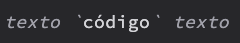
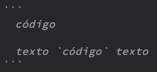

# Texto ✍️
- **Formato fichero**: MarkDown
- **Extensión del fichero**: .md
- **Ortografía**: Pasar un correcto ortográfico al texto siempre antes de enviarlo a la editorial.

[Enlace a la guía](./guia-markdown.md) de como dar formato al texto con el estandar MarckDown.

# Problema con el uso de comillas invertidas

Evitar el uso de las comillas invertidas (`) para indicar una palabra o
frase como código. El sistema de generación de libros no permite generar
un libro en el que se utilice las comillas invertidas fuera de un bloque
de código.

Ejemplo de como no debería utilizarse:

Las comillas invertidas (`) se pueden utilizar para crear un bloque de
código que abarque varias líneas de código. Dentro de ese bloque de código
si se podrá utilizar también las comillas invertidas.

Ejemplo:

